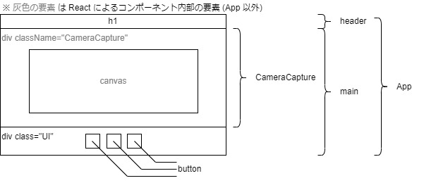

### wip glslでのフィルターを試せるツールを作成しています.

# ファイル構成
```
filter-contents
L README.md             # 本ドキュメント
L README_SRC            # 本ドキュメントの画像
L package.json          # プロジェクトの管理ファイル(特にバージョン)
L package-lock.json     # 触らない
L docs                  # 触らない
L node_modules          # 触らない
L public                # 後にファビコンを入れる
  L index.html          # 基本的に触らない
L src                   # React アプリに関連するソースファイルを保管
  L index.js            # ビルド時に本番環境用のレンダリング設定にすること
  L App.js              # メインコンポーネント
  L style.css           # デザイン
  L style_template.css  # デバッグ要デザイン
  L CameraCapture       # 
    L CameraCapture.js  # カメラキャプチャのコンポーネント(p5.jsの描画処理)
    L filterList.js     # フィルタ(シェーダファイル)のリスト管理
    L assets            # シェーダファイルの保管
```

# 動作確認の方法
## 公開中のもの(ビルド済み)
https://koya-kimura.github.io/filter-contents/

## ローカル作業(ビルド前のもの)
ターミナルで次のコマンドを実行してください
```
npm start
```

注意として，```index.html``` をブラウザアプリで開けたり，VSCodeの拡張機能 (Go Live など) を利用したりではうまく動作しません．

# フィルタの追加方法
次の手順が必要です．
1. ファイルのアップロード
1. ファイルリストの編集

## 手順1. ファイルのアップロード
```src\CameraCapture\assets``` でシェーダファイルを保管しています．このディレクトリに追加で実装したいフィルタのフラグメントシェーダ ```.frag``` を保管してください．必要に応じて頂点シェーダー ```.vert``` も追加してください．各シェーダファイルの名称は任意で問題ありません．

なお，このディレクトリには座標に加工処理をしない頂点シェーダーファイル ```main.vert```，
ポリゴンに加工処理をしないフラグメントシェーダーファイル ```main.frag```
がそれぞれ予め用意されています．

また，フラグメントシェーダではカメラのキャプチャを鏡のように左右反転で表示させるようにしてください．次に例として，```main.frag``` を示します．

```glsl
precision mediump float;

varying vec2 vTexCoord;

// カメラからキャプチャした画像
uniform sampler2D u_tex;

void main() {
  vec2 uv = vTexCoord;

  // 左右反転する処理
  uv.x = 1. - 1. * uv.x;

  vec4 col = texture2D(u_tex, uv);

  gl_FragColor = vec4(col);
}
```

## 手順2. ファイルリストの編集
```src\CameraCapture\fileList.js``` を編集します．

### (1) ファイルのインポート
```fileList.js``` に次の ```import``` 文を追記します．

- 頂点シェーダを追加したい場合
  ```javascript
  import V_任意の文字列 from "./assets/ファイル名.vert"
  ```

- フラグメントシェーダを追加したい場合
  ```javascript
  import F_任意の文字列 from "./assets/ファイル名.frag"
  ```

※ インポートする際に，頂点シェーダーでは「 ```V_``` 」，
フラグメントシェーダでは「 ```F_``` 」とつけていますが，こちらの記載有無も任意です．ただ，記載されている方が識別しやすいかなとは思います．

### (2) ファイルリストに追加
ファイルリストである ```fileList``` 配列に要素を次のように追加します．

``` javascript
export let fileList = [
  {
    vert: V_NORMAL,
    frag: F_NORMAL,
    remarks: "ノーマル"
  },
  // フィルタの追加
  {
    vert: V_任意の文字列,
    frag: F_任意の文字列,
    remarks: "なにかコメントがあれば(どういったフィルタかの説明など)"
  },
]
```

配列 ```fileList``` の要素はオブジェクトとして定義しています．オブジェクトのキーと値は次の通りです．

|キー|値|備考|
|---|---|---|
|```vert```|頂点シェーダーのファイルパス||
|```frag```|フラグメントシェーダのファイルパス|
|```remarks```|(任意) フィルタに関する備考や説明|
|```author```|(任意) 開発者|

- ```vert```，```frag``` キーでファイルパスを文字列で書かないこと
  - 必ず，```import``` 文で命名した「 ```V_任意の文字列``` 」もしくは「 ```F_任意の文字列```」にせよ．
  - 本ウェブアプリをビルドしたとき，ファイルパスにハッシュ値が入るため，この方法でしか適切にロードできない
  - 良い方法が見つかり次第，変更するが解決策は未検討
- 値に「 (任意) 」と記載されているキーは現時点ではなくてもよい
  - デバッグ的な用途
- 新たにキーを作成して React の実装を変えてもよい
  - 例えば，フィルタ名を値とする ```name``` キーを追加実装する
  - 今後のアップデートにてアプリ上に表示させるでもよい．

# Webアプリのスタイリング
css でのデザイン時に参考にしてください．
## コンポーネントの構成


# ビルド方法
完成していませんが，参考にしてください
- https://qiita.com/skm_bnn/private/5ede253d469bad566c4b#github-pages-へのデプロイ
